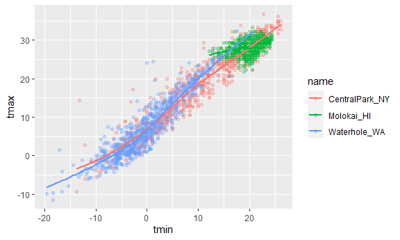
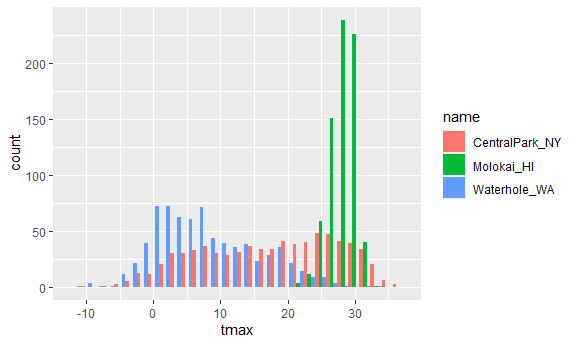

Visualization_full
================
Zhiyi Zhu
2023-10-03

``` r
library(tidyverse)
```

    ## ── Attaching core tidyverse packages ──────────────────────── tidyverse 2.0.0 ──
    ## ✔ dplyr     1.1.3     ✔ readr     2.1.4
    ## ✔ forcats   1.0.0     ✔ stringr   1.5.0
    ## ✔ ggplot2   3.4.3     ✔ tibble    3.2.1
    ## ✔ lubridate 1.9.2     ✔ tidyr     1.3.0
    ## ✔ purrr     1.0.2     
    ## ── Conflicts ────────────────────────────────────────── tidyverse_conflicts() ──
    ## ✖ dplyr::filter() masks stats::filter()
    ## ✖ dplyr::lag()    masks stats::lag()
    ## ℹ Use the conflicted package (<http://conflicted.r-lib.org/>) to force all conflicts to become errors

``` r
library(ggridges)
```

## Get the data for the plot

``` r
weather_df = 
  rnoaa::meteo_pull_monitors(
    c("USW00094728", "USW00022534", "USS0023B17S"),
    var = c("PRCP", "TMIN", "TMAX"), 
    date_min = "2021-01-01",
    date_max = "2022-12-31") |>
  mutate(
    name = recode(
      id, 
      USW00094728 = "CentralPark_NY", 
      USW00022534 = "Molokai_HI",
      USS0023B17S = "Waterhole_WA"),
    tmin = tmin / 10,
    tmax = tmax / 10) |>
  select(name, id, everything())
```

    ## using cached file: C:\Users\HUAWEI\AppData\Local/R/cache/R/rnoaa/noaa_ghcnd/USW00094728.dly

    ## date created (size, mb): 2023-10-03 16:10:10.639154 (8.542)

    ## file min/max dates: 1869-01-01 / 2023-09-30

    ## using cached file: C:\Users\HUAWEI\AppData\Local/R/cache/R/rnoaa/noaa_ghcnd/USW00022534.dly

    ## date created (size, mb): 2023-10-03 16:10:50.050356 (3.838)

    ## file min/max dates: 1949-10-01 / 2023-09-30

    ## using cached file: C:\Users\HUAWEI\AppData\Local/R/cache/R/rnoaa/noaa_ghcnd/USS0023B17S.dly

    ## date created (size, mb): 2023-10-03 16:11:03.173807 (0.996)

    ## file min/max dates: 1999-09-01 / 2023-09-30

## Make a plot

``` r
ggplot(weather_df, aes(x = tmin, y = tmax)) +
  geom_point()
```

    ## Warning: Removed 17 rows containing missing values (`geom_point()`).

<!-- -->

### Pipes and stuff

``` r
weather_df |>
  filter(name == "CentralPark_NY") |>
  ggplot(aes(x = tmin, y = tmax)) +
  geom_point()
```

<!-- -->

## Save ggplot objects

``` r
ggp_nyc_weather = 
  weather_df |>
  filter(name == "CentralPark_NY") |>
  ggplot(aes(x = tmin, y = tmax)) +
  geom_point() # dose not print something

ggp_nyc_weather #print the plot
```

<!-- -->

## Fancy plot

``` r
ggplot(weather_df, aes(x = tmin, y = tmax, color = name)) +
  geom_point(aes(color = name), alpha = .3) +
  geom_smooth(se = FALSE)
```

    ## `geom_smooth()` using method = 'loess' and formula = 'y ~ x'

    ## Warning: Removed 17 rows containing non-finite values (`stat_smooth()`).

    ## Warning: Removed 17 rows containing missing values (`geom_point()`).

<!-- -->

## Plot with facet

``` r
ggplot(weather_df, aes(x = tmin, y = tmax, color = name)) +
  geom_point(alpha = .3) +
  geom_smooth(se = FALSE) +
  facet_grid(. ~name)
```

    ## `geom_smooth()` using method = 'loess' and formula = 'y ~ x'

    ## Warning: Removed 17 rows containing non-finite values (`stat_smooth()`).

    ## Warning: Removed 17 rows containing missing values (`geom_point()`).

<!-- -->

## Different plot

``` r
ggplot(weather_df, aes(x = date, y = tmax, color = name)) +
  geom_point(aes(size = prcp), alpha = .3) +
  geom_smooth() +
  facet_grid(. ~ name)
```

    ## `geom_smooth()` using method = 'loess' and formula = 'y ~ x'

    ## Warning: Removed 17 rows containing non-finite values (`stat_smooth()`).

    ## Warning: Removed 19 rows containing missing values (`geom_point()`).

<!-- -->

### trying assigning a specific color

``` r
weather_df |>
  filter(name == "CentralPark_NY") |>
  ggplot(aes(x = date, y = tmax)) +
  geom_point(color = "blue")
```

<!-- -->

## Hex plot

``` r
weather_df |>
  ggplot(aes(x = tmin, y = tmax)) +
  geom_hex()
```

    ## Warning: Removed 17 rows containing non-finite values (`stat_binhex()`).

<!-- -->

## Line plot

``` r
weather_df |>
  filter(name == "Molokai_HI") |>
  ggplot(aes(x = date, y = tmax)) +
  geom_line(alpha = .5) +
  geom_point(size = .5)
```

    ## Warning: Removed 1 rows containing missing values (`geom_point()`).

<!-- -->

## Univariate(单变量的) plotting

``` r
ggplot(weather_df, aes(x = tmax, fill = name)) +
  geom_histogram(position = "dodge")
```

    ## `stat_bin()` using `bins = 30`. Pick better value with `binwidth`.

    ## Warning: Removed 17 rows containing non-finite values (`stat_bin()`).

<!-- -->

## Using a density plot

``` r
ggplot(weather_df,aes(x = tmax, fill = name)) +
  geom_density(alpha = .3, adjust = 2)
```

    ## Warning: Removed 17 rows containing non-finite values (`stat_density()`).

<!-- -->

## Using boxplot

``` r
ggplot(weather_df,aes(y = tmax, x = name))+
  geom_boxplot()
```

    ## Warning: Removed 17 rows containing non-finite values (`stat_boxplot()`).

<!-- -->

## Using violin plots

``` r
ggplot(weather_df,aes(y = tmax, x = name))+
  geom_violin()
```

    ## Warning: Removed 17 rows containing non-finite values (`stat_ydensity()`).

<!-- -->

## Using ridge plot

``` r
ggplot(weather_df,aes(x = tmax, y = name))+
  geom_density_ridges()
```

    ## Picking joint bandwidth of 1.54

    ## Warning: Removed 17 rows containing non-finite values
    ## (`stat_density_ridges()`).

<!-- -->
